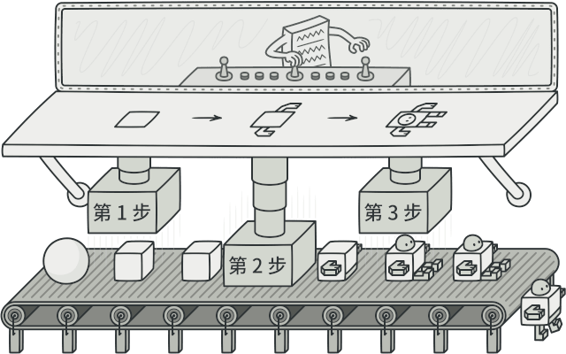
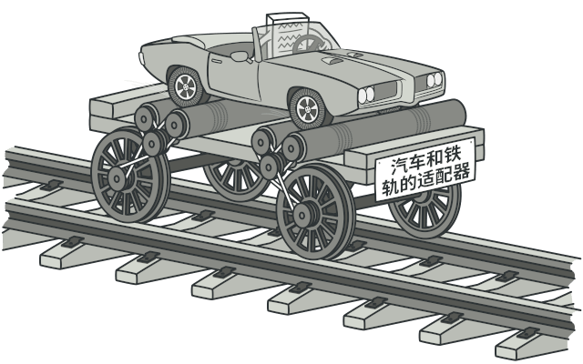

# Rust 设计模式汇总
这是一个个人项目，通过学习[Refactoring.Guru](refactoringguru.cn)的设计模式来解决项目开发中实际可能遇到的结构设计问题，为项目提供良好的架构。
> 所有模式设计示例均采用Rust实现，例子来自Refactoring，本项目仅作于示例学习和汇总，方便后续查阅使用

## 目录
- [目录](#目录)
- [设计模式](#设计模式)
  - [创建型模式](#创建型模式)
    - [抽象工厂](#抽象工厂)
    - [生成器/构建器](#生成器构建器)
    - [适配器](#适配器)
  - [结构性模式](#结构性模式)
  - [行为模式](#行为模式)
- [版权声明](#版权声明)

## 设计模式
### 创建型模式
#### 抽象工厂
星级: :star::star::star:

目录:  `examples/abstract-factory`

#### 生成器/构建器
星级：:star::star::star:

目录: `examples/builders`

### 结构性模式
#### 适配器
星级： :star::star::star:

目录 `examples/adapter`

#### 组合
星级： :star::star::star:

目录 `examples/composite`

### 行为模式
#### 命令
星级：:star::star::star:

目录 `examples/command`

## 版权声明
示意图片来自 [Refactoring.Guru](refactoringguru.cn) 仅用于学习和教学目的。所有权利归原作者所有。若涉及版权问题，请联系原作者或相应版权方。
